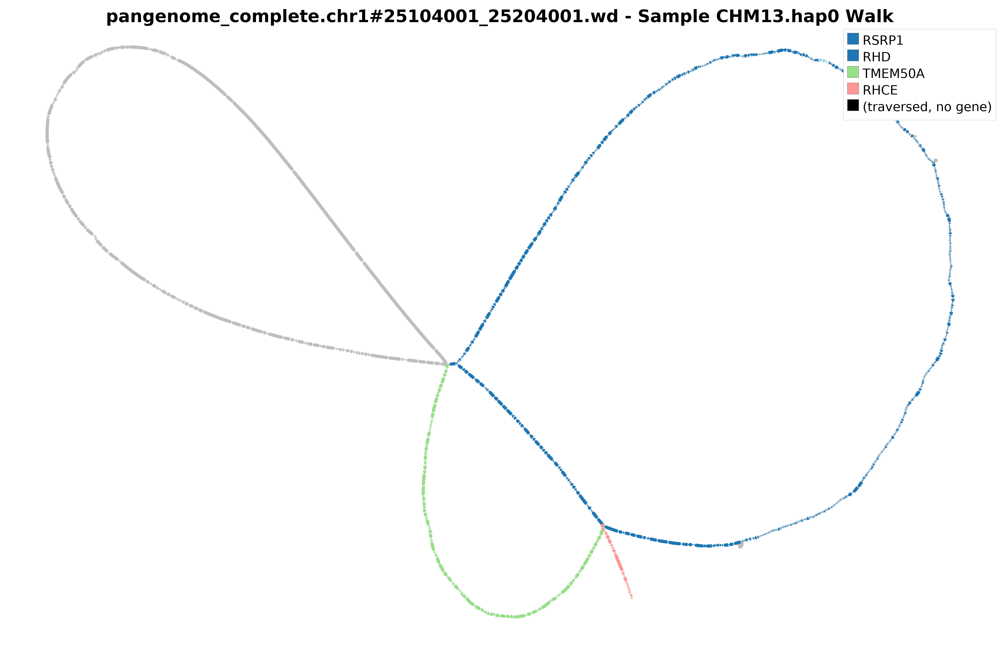
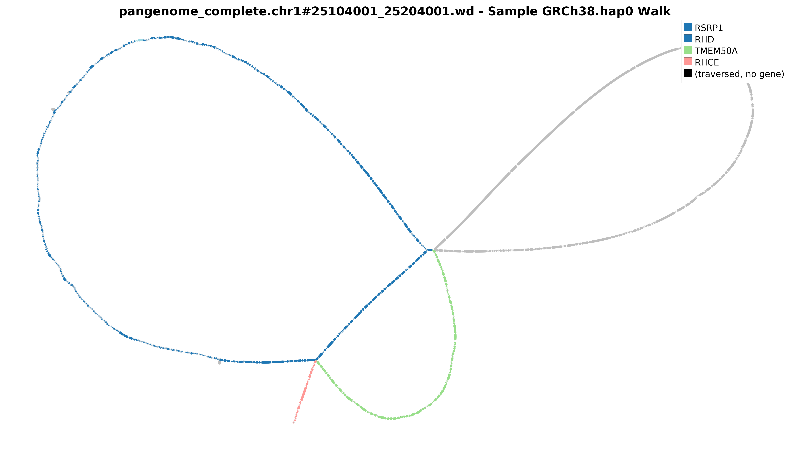
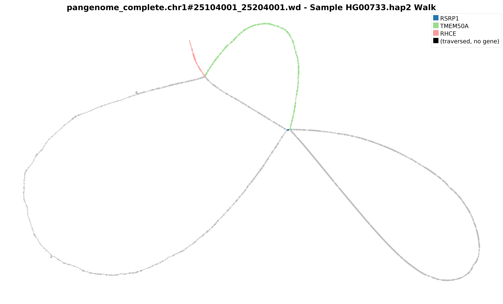
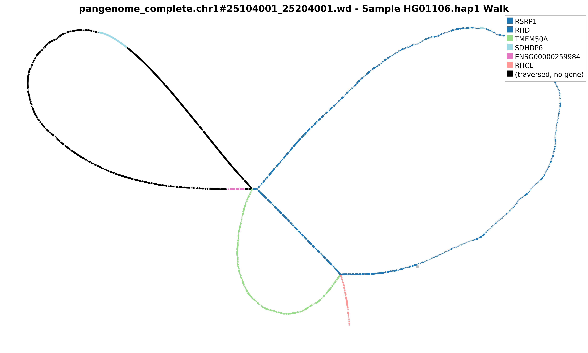
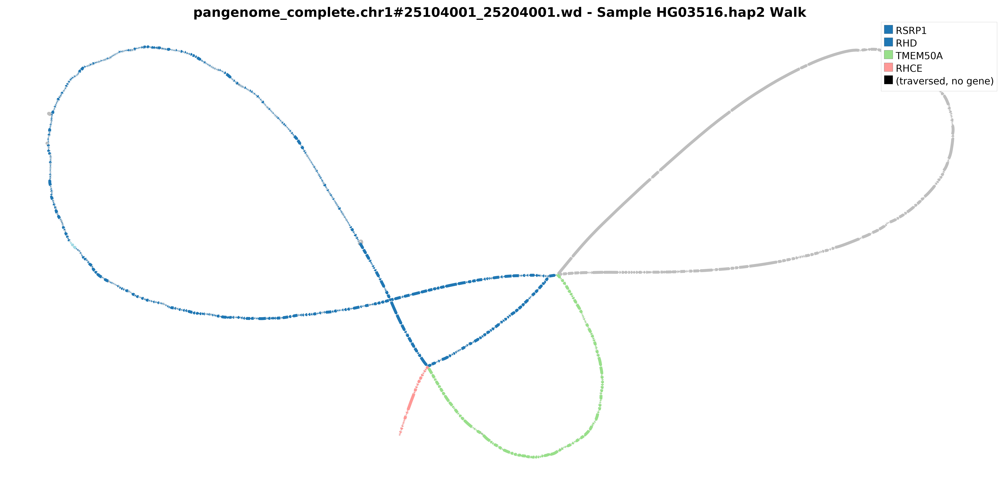

# Panscan `complex` Module — Tutorial

## Overview

The `complex` module identifies and visualizes complex structural variant loci in a pangenome graph. It detects regions with large SV bubbles, extracts subgraphs using `gfabase`, colors nodes by gene identity using `GraphAligner` alignments, and produces per-sample haplotype walk visualizations using `Bandage`.

---

## Defining a Complex SV Locus

As per the APR ([Arab Pangenome Reference](https://www.nature.com/articles/s41467-025-61645-w)) paper definition, a complex SV locus is defined as a genomic window containing **at least one top-level graph bubble (snarl) with a minimum allele size of 10,000bp and a minimum of 5 alternate alleles**. This reflects regions where multiple large, structurally distinct haplotypes co-exist in the population.

For reproducibility and direct comparison with HPRC-style analyses (following the methodology of the [HPRC draft pangenome paper](https://www.nature.com/articles/s41586-023-05896-x)), users can run with relaxed settings that lower the allele size threshold to 5,000bp (selected by the HPRC authors based on manual inspection of Bandage plots) and reduce the minimum allele count to 1. This will identify a broader set of structurally complex regions and allow direct comparison with HPRC published loci. See the parameter table and example commands below.

---

## Prerequisites

All tools (`gfabase`, `GraphAligner`, `Bandage`) are bundled in the panscan Singularity image (`panscan.sif`). You do not need to install them separately.

Required inputs:

| File | Description |
|---|---|
| `pangenome_complete.gfa(.gz)` | Pangenome graph in GFA format (from Minigraph-Cactus) |
| `pangenome_complete.gfab` | Indexed GFA database (built from GFA, see Step 2) |
| `pangenome_complete.vcf(.gz)` | Pangenome VCF |
| `genes.fa` | Gene sequences in FASTA (from Ensembl) |
| `annotation.gff3` | Gene annotation file (from Ensembl/Gencode) |

---

## A Note on `--sep_pattern`

The separator pattern used in your pangenome's path/walk names must match the `--sep_pattern` argument. This varies depending on how the pangenome was constructed. You can inspect it directly from your GFA:

```bash
grep "^W" pangenome_complete.gfa | head -3 | awk '{print $2, $3, $4}'
```

Common patterns:

| Pangenome | Example path name | `--sep_pattern` |
|---|---|---|
| HPRC v1.1 (CHM13-based) | `CHM13#1#chr1` | `#` |
| UPR (CHM13-based) | `CHM13#0#chr1` | `#0#` |
| GRCh38-based | `GRCh38#0#chr1` | `#0#` |

Using the wrong separator will cause gene coloring and walk extraction to fail silently. Always verify before running.

---
## Trying panscan complex on UPR Phase 1 Data

To run a trial analysis, the APR Phase 1 dataset is publicly available and provides a well-characterized pangenome suitable for testing the `complex` module end-to-end.

**Primary download:** [MBRU Arab Pangenome Reference](https://www.mbru.ac.ae/the-arab-pangenome-reference/)

**Backup / Zenodo archive:** [https://zenodo.org/records/17587133](https://zenodo.org/records/17587133)

Download the pangenome GFA, VCF, and use `--sep_pattern "#0#"` and `--ref_name CHM13` for this dataset.


## Step-by-Step

### Step 1 — Decompress GFA (if needed)

```bash
if [[ ! -f "pangenome_complete.gfa" ]]; then
    gunzip -c pangenome_complete.gfa.gz > pangenome_complete.gfa
fi
```

### Step 2 — Build GFAB index

The `.gfab` file is a SQLite-based indexed version of the GFA that enables fast coordinate-based subgraph extraction.

```bash
singularity exec -B /mnt:/mnt --no-home panscan.sif \
    gfabase load \
    -o pangenome_complete.gfab \
    pangenome_complete.gfa
```

This only needs to be done once per pangenome. The `.gfab` file can be reused for all subsequent `complex` runs.

### Step 3 — Align genes to pangenome graph

`GraphAligner` aligns gene sequences to the pangenome graph to identify which graph nodes correspond to which genes. This enables gene-colored Bandage visualizations.

```bash
singularity exec -B /mnt:/mnt --no-home panscan.sif \
    GraphAligner \
    -g pangenome_complete.gfa \
    -f genes.fa \
    -a genes_vs_pangenome.gaf \
    -x vg \
    --multimap-score-fraction 0.1 \
    --threads 32
```

The output `.gaf` file maps gene names to pangenome segment IDs and is reused across all regions. This step can be slow for whole-genome pangenomes — run it once and cache the result.

### Step 4 — Decompress VCF (if needed)

```bash
if [[ ! -f "pangenome_complete.vcf" ]]; then
    gunzip -c pangenome_complete.vcf.gz > pangenome_complete.vcf
fi
```

### Step 5 — Run complex module

**UPR-definition (default, stricter):**

```bash
panscan complex \
    pangenome_complete.vcf \
    pangenome_complete.gfab \
    --gff3 annotation.gff3 \
    --gaf_file genes_vs_pangenome.gaf \
    --ref_name CHM13 \
    --sep_pattern "#0#" \
    --threads 32 \
    --plot_threads 8 \
    --plot_min_free_gb 30 \
    --min_free_gb 20
```

**HPRC-style (relaxed, for comparison with published loci):**

```bash
panscan complex \
    pangenome_complete.vcf \
    pangenome_complete.gfab \
    --gff3 annotation.gff3 \
    --gaf_file genes_vs_pangenome.gaf \
    --ref_name CHM13 \
    --sep_pattern "#0#" \
    -s 5000 \
    -a 1 \
    -n 1 \
    -l 100000 \
    --sites 1 \
    --threads 32 \
    --plot_threads 8 \
    --plot_min_free_gb 30 \
    --min_free_gb 20
```

---

## Key Parameters

| Parameter | Default | Description |
|---|---|---|
| `-s` | 10000 | Minimum SV size (bp) to define a complex site (UPR: 10000, HPRC-style: 5000) |
| `-a` | 5 | Minimum number of ALT alleles at a site (UPR: 5, HPRC-style: 1) |
| `-n` | 1 | Minimum number of large variants per site |
| `-l` | 100000 | Window size (bp) for region definition |
| `--sites` | 1 | Minimum complex sites per window |
| `--ref_name` | CHM13 | Reference sample name as it appears in the pangenome W lines |
| `--sep_pattern` | `#0#` | Path name separator — must match your pangenome (see note above) |
| `--min_free_gb` | 20 | Minimum free RAM (GB) before launching region workers |
| `--plot_min_free_gb` | 0 | Minimum free RAM (GB) before launching each Bandage plot job |
| `--plot_threads` | auto | Number of parallel Bandage workers (see warning below) |
| `--threads` | auto | Total thread budget |

---

## ⚠️ Bandage Plotting — Important Warning

Bandage is a single-threaded application that loads the entire graph into memory for layout computation. Running many Bandage jobs in parallel causes significant I/O and memory overhead on shared HPC clusters and **will cause job crashes** if not properly controlled.

**Always set the following:**

- `--plot_min_free_gb 20` to `40` — ensures sufficient free RAM before each Bandage job launches. Use 40GB for HPRC-scale pangenomes.
- `--plot_threads` to **no more than 8–10** regardless of how many CPUs your job has allocated. More parallel Bandage workers does not improve throughput — it causes memory contention, I/O saturation, and crashes.

```bash
panscan complex \
    ... \
    --threads 64 \
    --plot_threads 8 \
    --plot_min_free_gb 30
```

The graph extraction and walk generation steps scale well with `--threads`. Only the final Bandage rendering step needs to be throttled. Keeping `--plot_threads` low will **not meaningfully affect total runtime** — panscan pipelines the produce and plot steps concurrently, so Bandage rendering overlaps with graph extraction for subsequent regions.

---

## Outputs

```
./
├── complex_regions.csv                   # Detected complex regions with coordinates
├── complex_sites_summary.csv             # Per-site summary with gene annotations
└── all_plottables/
    └── pangenome_complete.<region>.wd/
        ├── <region>.gfa                  # Reference-anchored regional subgraph
        ├── color_csvs/
        │   ├── all_colors.csv            # Node → gene color mapping (all genes)
        │   ├── pc_colors.csv             # Node → gene color mapping (protein-coding only)
        │   ├── gene_colors/              # Per-gene node color CSVs
        │   └── <sample>.hap<N>.walks.csv # Per-sample haplotype walk color CSVs
        ├── colored_gfas/
        │   ├── all_colors_<region>.gfa         # Full graph colored by all genes
        │   ├── pc_colors_<region>.gfa          # Protein-coding genes only
        │   └── <sample>.hap<N>_<region>.gfa    # Per-sample haplotype walk GFAs
        ├── bandage_images/               # Raw Bandage PNG outputs
        └── bandage_images_with_legend/   # Bandage images with gene color legend
```

---

## HPC Example (SLURM)

```bash
#!/bin/bash
#SBATCH -p your-partition
#SBATCH --cpus-per-task 64
#SBATCH --mem 300G
#SBATCH --output=run.txt
#SBATCH --error=run.err
#SBATCH --job-name=panscan-complex

set -euo pipefail

THREADS="${SLURM_CPUS_PER_TASK:-64}"
SIF="/path/to/panscan.sif"
BIND="/mnt"

# Step 1 — decompress GFA
if [[ ! -f "pangenome_complete.gfa" ]]; then
    gunzip -c pangenome_complete.gfa.gz > pangenome_complete.gfa
fi

# Step 2 — build gfab index (once per pangenome)
if [[ ! -f "pangenome_complete.gfab" ]]; then
    singularity exec -B ${BIND}:${BIND} --no-home ${SIF} \
        gfabase load -o pangenome_complete.gfab pangenome_complete.gfa
fi

# Step 3 — align genes to graph (once per pangenome)
if [[ ! -f "genes_vs_pangenome.gaf" ]]; then
    singularity exec -B ${BIND}:${BIND} --no-home ${SIF} \
        GraphAligner \
        -g pangenome_complete.gfa \
        -f genes.fa \
        -a genes_vs_pangenome.gaf \
        -x vg --multimap-score-fraction 0.1 \
        --threads ${THREADS}
fi

# Step 4 — decompress VCF
if [[ ! -f "pangenome_complete.vcf" ]]; then
    gunzip -c pangenome_complete.vcf.gz > pangenome_complete.vcf
fi

# Step 5 — run complex module (HPRC-style relaxed settings)
panscan complex \
    pangenome_complete.vcf \
    pangenome_complete.gfab \
    --gff3 annotation.gff3 \
    --gaf_file genes_vs_pangenome.gaf \
    --ref_name CHM13 \
    --sep_pattern "#0#" \
    -s 5000 -a 1 -n 1 -l 100000 --sites 1 \
    --threads ${THREADS} \
    --plot_threads 8 \
    --plot_min_free_gb 30 \
    --min_free_gb 50

echo "Done."
```

---

## Notes

**Reference name (`--ref_name`)** must match exactly how the reference sample appears in your pangenome W lines — this is the sample name (e.g. `CHM13`), not the chromosome name.

**Sample haplotype visualization** — each sample's walk through the region is extracted and colored by gene identity. Samples with missing genotypes (`GT: .|.`) at large SVs will show minimal traversal through the reference graph. This is biologically correct — it indicates the sample carries a large private structural variant not represented in the reference-anchored graph, and should be interpreted as such rather than as a pipeline failure.

**Memory** — `--min_free_gb` controls region-level parallelism (graph extraction workers), while `--plot_min_free_gb` controls Bandage-level parallelism independently. Set both appropriately for your cluster. For HPRC-scale pangenomes, `--min_free_gb 50` and `--plot_min_free_gb 30` are recommended starting points.

**⏱ GFAB Conversion Time Reference**
Building the `.gfab` index is a one-time operation per pangenome. Approximate runtimes on a standard HPC node:
- HPRC v1.1: ~15 minutes
- HPRC v2: ~1.5 hours

Plan accordingly and do not include this step in time-sensitive job allocations.


## Example Output — RHD/RHCE Locus (chr1:25,104,001-25,204,001)

The RHD/RHCE locus on chromosome 1 encodes the Rhesus blood group antigens 
and is one of the most structurally complex regions in the human genome. 
It contains two highly homologous genes (RHD and RHCE) arranged in tandem, 
separated by TMEM50A, and flanked by RSRP1. The high sequence similarity 
between RHD and RHCE makes this locus prone to gene conversion, inversion, 
and copy number variation — producing a diverse set of structural haplotypes 
across human populations.

This region was selected as a benchmark because it was independently analyzed 
in the HPRC draft pangenome paper, allowing direct 
comparison of panscan outputs with published results.

---

### Color scheme

In all walk plots below:
- **Blue** — RHD gene nodes
- **Green** — TMEM50A gene nodes  
- **Pink/Red** — RHCE gene nodes
- **Light blue** — RSRP1 gene nodes
- **Black** — traversed by this haplotype but not overlapping any known gene
- **Grey** — present in the pangenome graph but not traversed by this haplotype

---

### CHM13 reference haplotype — RHD;RHCE



The CHM13 reference takes the canonical `RHD;RHCE` haplotype — the most 
common structural form present in ~48% of haplotypes in the HPRC cohort. 
The walk traverses RHD (blue, large right loop), TMEM50A (green, lower loop), 
and a short segment of RHCE (pink). The left loop is entirely grey — it 
represents an alternate structural path (the RHCE-only haplotype) not taken 
by CHM13.

---

### GRCh38 reference haplotype — RHD;RHCE



GRCh38 also carries the `RHD;RHCE` haplotype, taking a structurally similar 
path to CHM13 through RHD and TMEM50A. A subtle difference is visible at the 
central junction — GRCh38 diverges slightly from CHM13 through a small 
alternate bubble, reflecting minor sequence differences between the two 
reference assemblies at this locus. The large right loop (alternate path) 
is untraversed (grey).

---

### HG00733 haplotype 2 — RHCE only (RHD deletion)



HG00733 hap2 carries the `RHCE only` structural haplotype — it traverses 
TMEM50A (green) and RHCE (pink) but completely skips the RHD loop. This 
corresponds to an RHD deletion, producing an RhD-negative phenotype. 
Individuals homozygous for this haplotype are RhD-negative, which is 
clinically significant for blood transfusion compatibility and hemolytic 
disease of the fetus and newborn. Both the left and right loops are 
untraversed (grey), confirming this haplotype takes a distinct path 
through the graph that bypasses both RHD copies.

---

### HG01106 haplotype 1 — Novel insertion (black traversal)



HG01106 hap1 is the most structurally distinctive haplotype shown here. 
It traverses RHD (blue) and TMEM50A (green) like the reference, but also 
takes a large left loop that is colored **entirely black** — meaning this 
haplotype traverses a substantial amount of sequence that does not overlap 
any annotated gene. This black traversal represents either a large novel 
insertion, a gene conversion segment from a paralogous sequence, or an 
inversion that routes the haplotype through non-genic sequence before 
rejoining the main graph. This is consistent with the `RHD-RHCE(n)-RHD` 
class of complex haplotypes identified in the HPRC paper, where gene 
conversion events between RHD and RHCE introduce paralogous sequence 
variants. The black coloring directly highlights where the biological 
complexity lies — sequence traversed by this haplotype that falls outside 
current gene annotations and warrants further investigation.

---

### HG03516 haplotype 2 — RHD;RHCE variant



HG03516 hap2 carries a structural haplotype similar to the reference 
`RHD;RHCE` form but with a visibly different routing through the central 
junction of the graph. The haplotype traverses RHD (blue), crosses through 
the junction twice (visible as the crossover pattern in the center), then 
continues through TMEM50A (green) and RHCE (pink). This crossing pattern 
suggests an inversion or a more complex rearrangement at the RHD/RHCE 
boundary relative to the reference path — a structural variant that would 
be invisible to short-read sequencing but is clearly resolved in the 
pangenome graph.

---

These five examples demonstrate panscan's ability to distinguish structurally 
distinct haplotypes at complex loci, identify gene content along each 
haplotype path, and flag novel or non-genic traversals that may represent 
undescribed structural variants. The same visualization is automatically 
produced for every sample in the pangenome across all detected complex regions.
